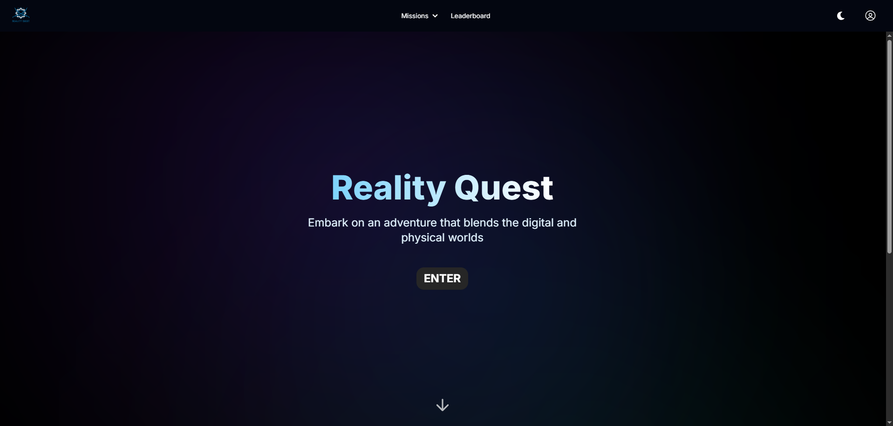

## What is MAC Reality Quest? 🌠

Reality Quest is the Muslim Association of Canada (MAC)'s annual alternate reality game (ARG), showcased at the MAC Convention in Toronto, Canada. In other words, it is a convnetion-wide puzzle game and scavenger hunt with a particular focus on Islamic education. Feel free to visit the website at https://realityquest.vercel.app/!

## Rules/How to Play the Game

This game will go live throughout the MAC convention in Toronto every year. The rules are simple: register on the website with your team (of 1-5 players) and attend the introductory presentation at the convention in order to get started off with your first mission. Beginning with "M1" on the website, watch the associated video and enter the correct answer to advance in the game. Finish at the top of the leaderboard (i.e. as fast as possible) to win the grand prize!

## Total Teams Registered in Reality Quest 2024: 37
## Total Teams Registered in Reality Quest 2024: 72

